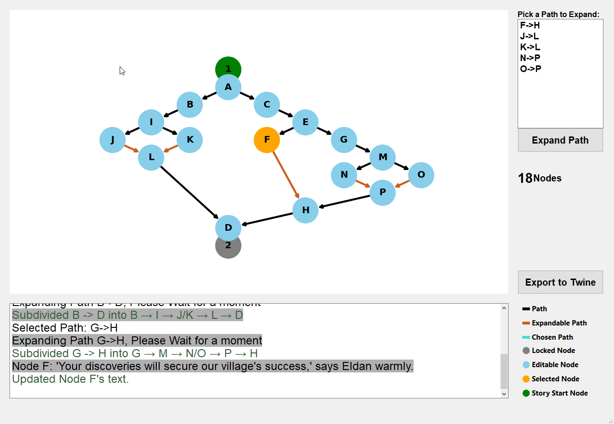
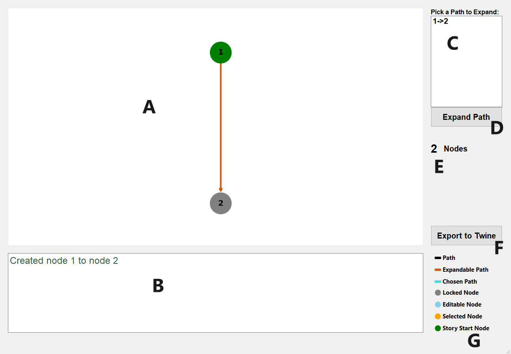
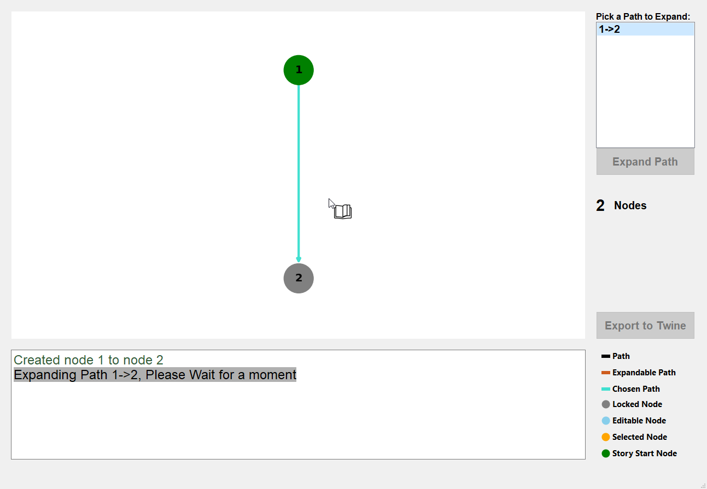
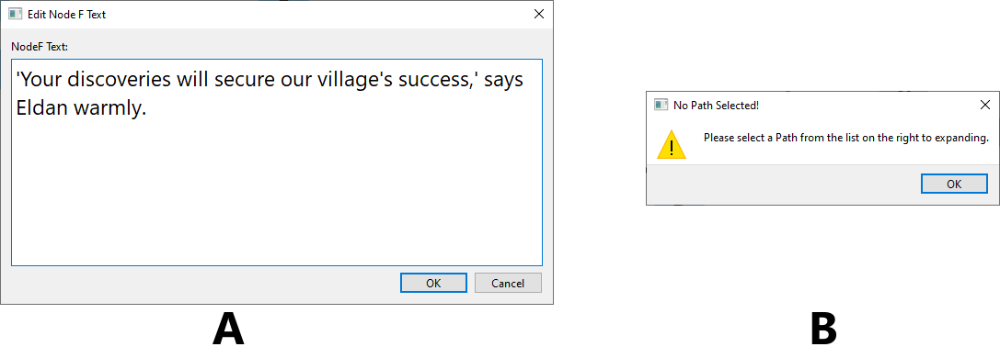

# StoryXpander



StoryXpander is my Master’s Thesis project focused on automated narrative generation. It takes a minimal story input and utilizes LLMs to programmatically subdivide the plot into a series of interconnected, auto-generated choices—creating a unique, branching experience every time.
If you'd like to read about my thesis here's the link to it: [Link](https://scholar.tecnico.ulisboa.pt/records/wEfXYeMUfd18DeCS-Hz2DQk5MvxKOYVo9c6j)

# How to install/run
1. create a virtuan env using ```python -m virtualenv venv```
2. make sure you activate the virtualenv by doing ```source venv\bin\activate```
3. run the commando: ```pip install -r requirements.txt```
4. make sure ollama is installed, if not run ```sudo dnf install ollama```
5. download the LLM we'll be using using the command ```ollama pull phi3:3.8b```
6. generate the new model using the command ```ollama create eldoria-story -f .\LLM_file.modelfile```
7. run the main python script with ```python main.py```

**And that's It you're done!**

# How to use the program



Refer to the labels (A-G) in the image above to navigate the StoryXpander interface:

* A. Interactive Canvas: The main workspace for viewing your story graph. Use your mouse to drag/pan and the wheel to zoom. The view auto-centers after every expansion to keep your full narrative in sight.
* B. Activity Log: A real-time feedback window. It displays node content, confirms successful expansions, and alerts you to any system errors.
* C. Path Selector: A list of all available paths that can be subdivided. Selecting a path here highlights it on the main canvas for easy identification.
* D. Expand Path Button: Triggers the LLM to subdivide the selected path, generating new intermediate nodes and branching choices.
* E. Node Counter: Tracks the total complexity of your story by showing the current number of nodes in the graph.
* F. Export to Twine: Instantly converts your graph into a .twee or Twine-compatible file, allowing you to play your story immediately in any Twine compiler.
* G. Visual Legend: A quick guide to interface symbols:
  * Circles: Story Nodes (Start, Editable, Locked, or Selected).
  * Rectangles: Connecting Paths.
  * Color Coding: Helps distinguish between the starting point, editable content, and currently active selections.

When you click on a edge (In orange) that edge will turn blue (which means it's selected) and then you can expland as it's shown in the following image:



Once it's done, as referede above, the view auto-centers to view the full narrative and the goal is to keep subdividing as much as you'd like.
Node 1 and 2 are locked by default for this project but you can always change them In the code. But once you subdivide the first time you're free to change any text on any blue node that the LLM creates for you.


Refer to the labels (A and B) in the image above:
* A. Editor window for nodes, when you double click on a blue node you can edit your text. 
* B. When you try to expand the program does a check to see if it can expand a select node, if there's an issue a popup will appear to inform you.

When you're ready and feel like you have a decent story you can always export it by clicking on the export button, 'Export to Twine' (G), and then you can open it using any Twine compiler.
